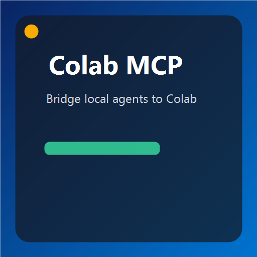
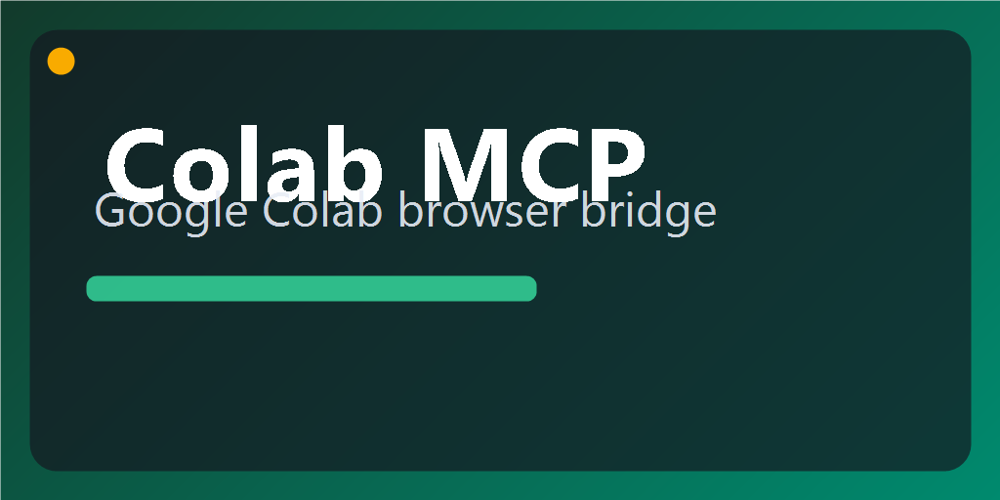
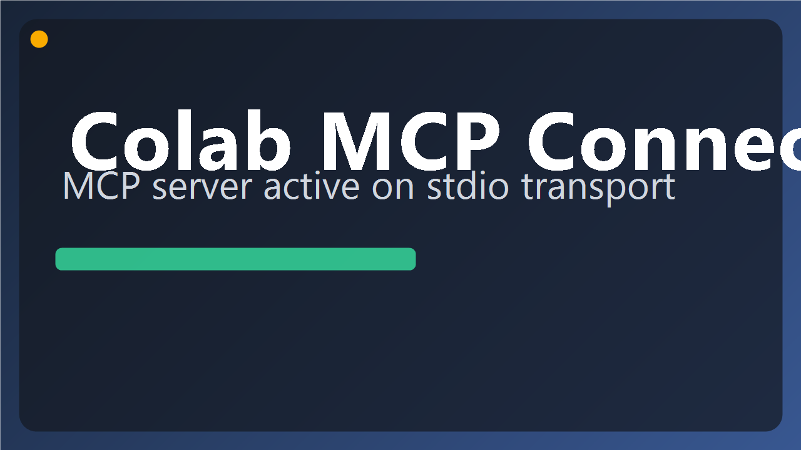

# Colab MCP Plugin

Local Codex plugin that runs the upstream Colab MCP server and exposes Colab tools in a local MCP-capable client.

- Upstream: https://github.com/googlecolab/colab-mcp
- Plugin path: `plugins/colab-mcp`
- Marketplace id: `plugin://colab-mcp@local-marketplace`

## Images





## What Is Configured

`./.mcp.json` is wired to run a hardened launcher script:

- `command`: `pwsh`
- `args`: `-NoLogo -NoProfile -ExecutionPolicy Bypass -File ...\scripts\start-colab-mcp.ps1`
- `env.UV_CACHE_DIR`: `C:\Users\james\OneDrive\Documents\Playground\.uv-cache`
- `env.UV_PYTHON`: `python`
- `timeout`: `30000`

This avoids the Windows `uv` permission issues seen with default AppData cache paths.

## Prerequisites

- `uv` installed and available in PATH.
- `python` installed and available in PATH.
- A local client that supports dynamic MCP tools (`notifications/tools/list_changed`).
- An active Google Colab tab open in your browser while using the server.

## Quick Start

1. Install/refresh plugin in Codex from local marketplace entry:
   - `@colab-mcp` (source: `plugin://colab-mcp@local-marketplace`)
2. Keep at least one Colab notebook tab open.
3. In a fresh chat/session, invoke plugin:
   - `@colab-mcp`
4. Ask for tool usage (example):
   - "list colab tools"
   - "run this in colab: print(2 + 2)"

## Manual Server Test

Run this directly:

```powershell
pwsh -NoLogo -NoProfile -ExecutionPolicy Bypass -File "C:\Users\james\OneDrive\Documents\Playground\plugins\colab-mcp\scripts\start-colab-mcp.ps1" --help
```

Expected: usage output for `colab-mcp`.

## MCP Handshake Smoke Test

The plugin includes an end-to-end stdio JSON-RPC smoke test:

```powershell
python "C:\Users\james\OneDrive\Documents\Playground\plugins\colab-mcp\scripts\mcp_smoke_test.py"
```

Behavior:

- Starts the MCP server using plugin launcher config.
- Sends `initialize` and `tools/list`.
- Prints discovered tool names.
- Attempts one best-effort command/code tool call if a suitable tool is found.

## Non-Standard Package Index (Corporate Environments)

If your environment blocks default index resolution, set:

```powershell
$env:COLAB_MCP_USE_PYPI_INDEX='1'
```

Then start the server again. The launcher will append:

- `--index https://pypi.org/simple`

## Files

- [`.mcp.json`](./.mcp.json)
- [`scripts/start-colab-mcp.ps1`](./scripts/start-colab-mcp.ps1)
- [`scripts/mcp_smoke_test.py`](./scripts/mcp_smoke_test.py)
- [`.codex-plugin/plugin.json`](./.codex-plugin/plugin.json)

## Troubleshooting

- Symptom: plugin installs but no tools appear.
  - Action: open an active Colab tab, then restart the chat/client session so dynamic tools refresh.
- Symptom: `uv` permission/access errors.
  - Action: keep launcher defaults (`UV_CACHE_DIR` + `UV_PYTHON`) as configured.
- Symptom: Git/index resolution failures.
  - Action: rerun with `COLAB_MCP_USE_PYPI_INDEX=1`.
